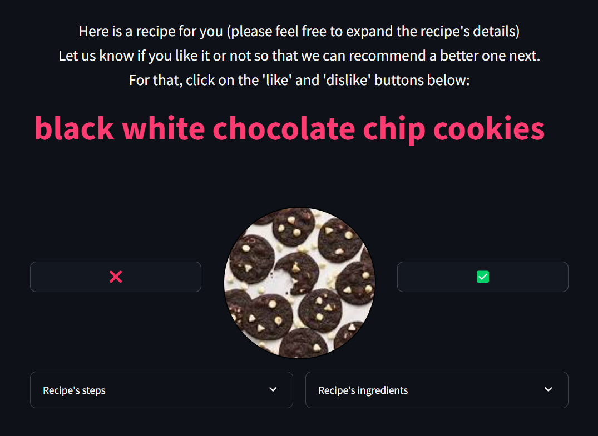
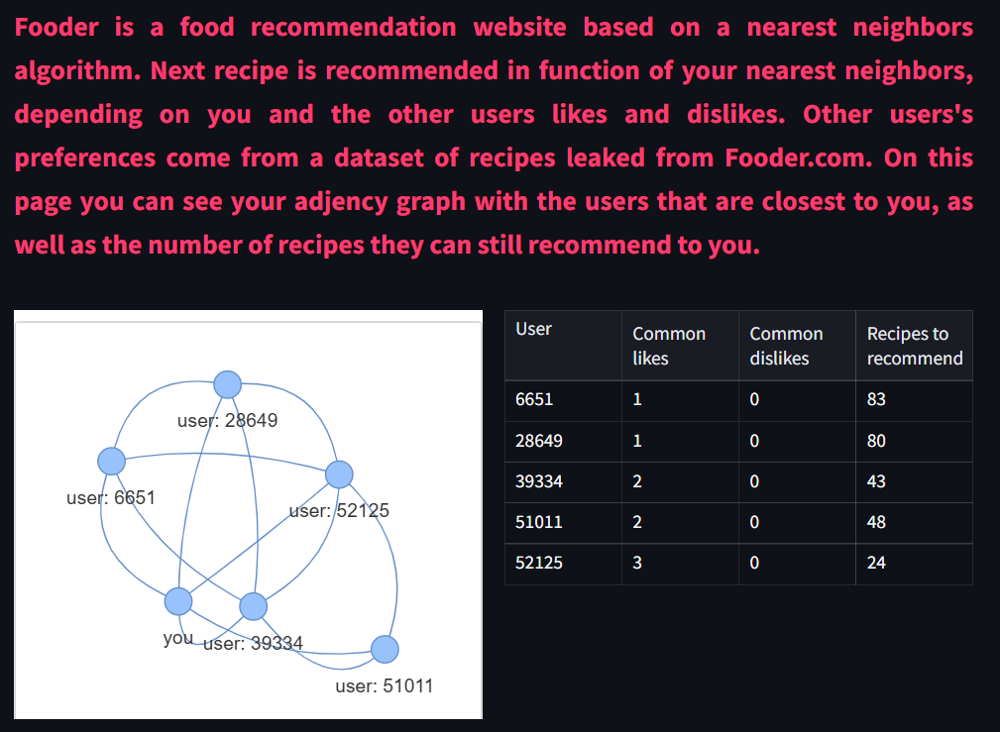

# Fooder 

**Fooder is a webapp coded in Python which recommends recipes based on the user's preferences compared to a database from Food.com**

---
<h3 align="center">
    Database from Food.com: <a href="https://www.kaggle.com/datasets/shuyangli94/food-com-recipes-and-user-interactions/data">dataset used on kaggle</a>
</h3>

---

<h3 align="center">
    🍕 Try it out here: <a href="https://fooder.streamlit.app/"> Fooder on streamlit 🍰 </a>
</h3>

---

<table>
    <tr><td></td><td></td></tr>
</table>

## Idea behind the application

The goal of this application was to exploit the data from Food.com and build an application to show our results. We chose to go with a recipe recommendation app.  
First step was to preprocess the dataset, this preprocessing can be found in a notebook in the [preprocessing folder](./preprocessing/). 

We divided the dataset between main courses and dessert recipes. The first step of the app is for the user to choose a type of recipe, to get a random recommendation.

Then the user can scroll the details of the recipe, like of dislike the recipe, and the next recommendation will take into account the historic of preferences.

At all moment, an historic of the preferences is visible in the sidebar, with which the user can come back on a recipe and change its preference. 

In the sidebar is also accessible a graph page, where the user can see a graph of its nearest neighbors (in the dataset of users from Food.com) and other statistics.

Further explications on how recommendations are made can be found in the [sphinx documentation](./docs/).


## How to run locally

### Prerequisites
- Python 3.12 or higher

### Poetry installation

Our project was coded using Poetry. 

To get Poetry, you can look at the [poetry website](https://python-poetry.org/).

### Local run with Poetry

First step is to clone the repository to you machine 
```bash
git clone https://github.com/Luca-Hachani/WebApp_Food.git
cd WebApp_Food
poetry install
```

Then to run the app locally:
```bash
poetry shell
streamlit run webapp_food/fooder.py
```

Or outside of poetry:
```bash
poetry run streamlit run webapp_food/fooder.py
```

## Future modifications

If you want to change the datasets used you may need to install Git LFS on your machine. 
Procedure to do so can be found [here](https://docs.github.com/en/repositories/working-with-files/managing-large-files/installing-git-large-file-storage).

## Context of this project

This project was done as a part of our Mastère Specialisé in Artificial Intelligence at Télécom Paris, during the course Kit Big Data (BGDIA700).

---


Authors :
Louis Borreill, Luca Hachani, Merlin Poitou

