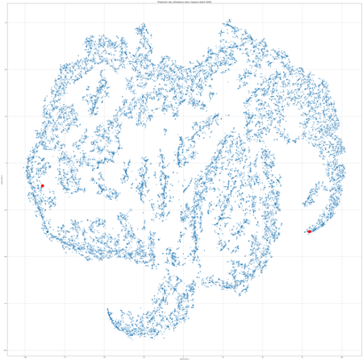
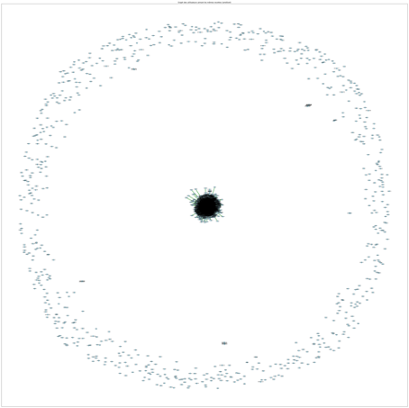
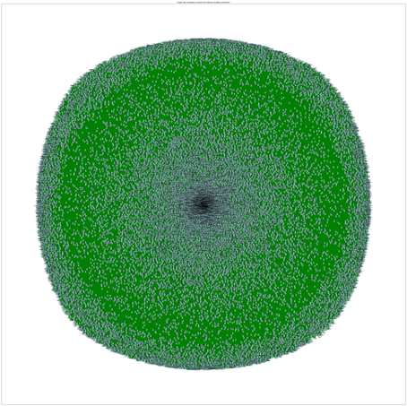
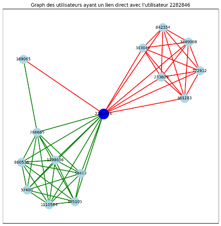
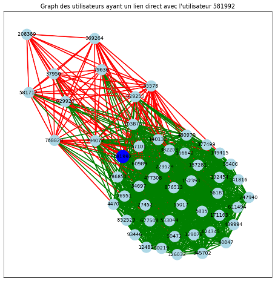

=============================
Explanation of Preprocessing 
=============================

Preprocessing Steps
===================

Our first step was to distinguish main dishes from desserts, based on the assumption 
that tastes differ between these two categories. To achieve this, we identified 
which recipes were main dishes and which were desserts by examining the most 
commonly used tags:

- **Main dishes:** *main-dish*, *meat*, *vegetables*, *seafood*
- **Desserts:** *desserts*, *cookies-and-brownies*, *chocolate*

Each recipe associated with these tags was assigned a type (main dish or dessert) 
to separate them.

Binarizing User Ratings
=======================

Our second decision was to binarize all user ratings to distinguish liked recipes 
(rating of 1) from disliked recipes (rating of -1). To do this for each user 
individually, we:

1. Grouped all ratings for each user.
2. Applied a K-means clustering algorithm to separate ratings into two clusters: 
   "like" and "dislike."

Matrices for Main Dishes and Desserts
=====================================

To further refine preprocessing, we created two matrices—one for main dishes and 
one for desserts. In these matrices:

- Rows represent user IDs.
- Columns represent recipe IDs.
- Values are 1 for likes, -1 for dislikes, and 0 if the user did not rate the recipe.

Visualizing User Preferences
============================

We attempted to visualize user preferences using two different methods.

Method 1: SVD and TSNE
----------------------

1. Applied SVD (Singular Value Decomposition) to reduce the dimensionality of our 
   matrices to 5 components, intended to represent fundamental tastes (sweet, salty, 
   bitter, sour, umami).
2. Reduced the dimension from 5 to 2 using TSNE, enabling plotting of the results.

While this approach produced an interesting visualization, verification revealed 
that users who were suppose to be close, were not close on the graph. Since, the 
SVD produces coefficients that were difficult to interpret, our initial assumption 
of representing "tastes" was wrong.

   Visualization of the SVD and TSNE reduction

Method 2: Network Graphs
-------------------------

We constructed network graphs where each user is represented by a node, and 
an edge is drawn between two users if they both liked the same recipe. The first 
graph highlighted some isolated users who only liked unique recipes that no one 
else rated. These users and their unique recipes provided no useful insight for the 
recommendation algorithm.

   Visualization of the network graph

To address this, we applied the following criteria:

- Each user must have at least two ratings, including at least one like.
- Each recipe must have at least one rating.

Although recipes with a single rating do not influence the user-user distance 
calculations, they remain recommendable.

After applying these rules, we observed a large number of interconnections among 
users (edges shown in green). However, the global graph remained unreadable. 
To improve readability, we chose to display subgraphs from random samples of users, 
incorporating both likes and dislikes.

   Visualization of the network graph with dropped isolated users

   Visualization of sub network graph of user 2282846

   Visualization of sub network graph of user 581992

Refining the Visualization
==========================

Even with subgraphs, the network remained sometimes difficult to interpret. To 
address this, we decided to:

1. Split the graph into two separate graphs (one for likes and one for dislikes).
2. Display only the *k* nearest neighbors of a given user in the application.

This approach resulted in clearer, more meaningful visualizations for the end user.
